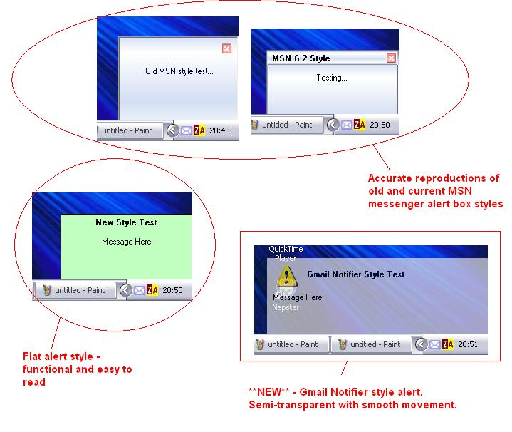



## Popup Alerts v 2\.0

### Description

This code produces four styles of Popup Alert windows in the bottom right corner of the screen.

Upgrades from v 1.1 are that the positioning will work with all resolutions/screen sizes, and I have added a Gmail Notifier style alert, which appears semi-transparent like the real one in XP/2k, or normal in other versions of Windows.

Still featuring are the two MSN Messenger style popups, which are pretty accurate, and a simple flat style one for functionality.

The MSN style ones use bitmaps and therefore aren't customizable, but the flat and Gmail style ones are, including an image on the Gmail one.

Hyperlink capabilities are built into the two MSN style popups. All feature standard title and message areas, except Old MSN, which doesn't have a title bar in keeping with its real counterpart.

Please vote :-)
 
### More Info
 

             |
---                |---
**Submitted On**   |2004-12-11 21:00:32
**By**             |[Tom Hendriks](https://github.com/Planet-Source-Code/PSCIndex/blob/master/ByAuthor/tom-hendriks.md)
**Level**          |Intermediate
**User Rating**    |4.9 (44 globes from 9 users)
**Compatibility**  |VB 3\.0, VB 4\.0 \(16\-bit\), VB 4\.0 \(32\-bit\), VB 5\.0, VB 6\.0
**Category**       |[Graphics](https://github.com/Planet-Source-Code/PSCIndex/blob/master/ByCategory/graphics__1-46.md)
**World**          |[Visual Basic](https://github.com/Planet-Source-Code/PSCIndex/blob/master/ByWorld/visual-basic.md)
**Archive File**   |[Popup\_Aler18293212142004\.zip](https://github.com/Planet-Source-Code/tom-hendriks-popup-alerts-v-2-0__1-57673/archive/master.zip)

### API Declarations

Uses some for the semi-transparent stuff

